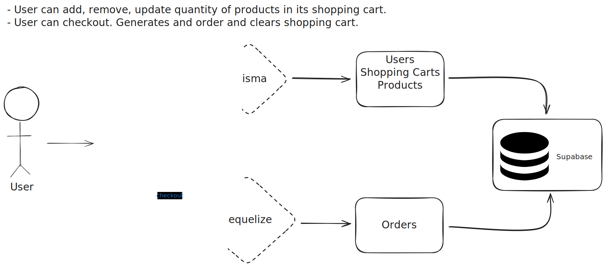
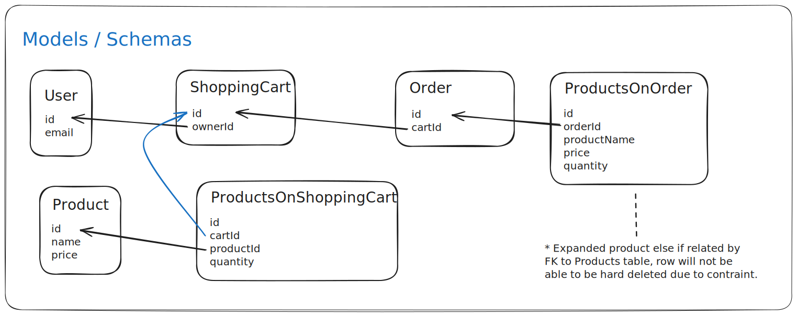

# Project: PESS

**P**risma - **E**xpress - **S**upabase - **S**equelize

# Objectives

- Reinforce Express.js knowledge
- Learn Prisma ORM
- Learn Sequelize ORM

# Architecture



# Models



# Running API

## Install packages

```bash
cd ./api
pnpm i
```

# Setting Up Supabase DB

[Read this guide](https://supabase.com/partners/integrations/prisma) to learn about transaction mode and session mode in Supabase. It has to do with the connection strings and their permitted operations since we need to do migrations with both Prisma and Sequelize and use a client with different permissions for our queries with Express.

### .env template

```
DATABASE_URL=""
DIRECT_URL=""
```

# Prisma

## 1. Generating Prisma schema + client

```bash
pnpm prisma:generate
```

## 2. Apply Prisma migrations to Supabase DB

```bash
pnpx prisma migrate deploy
```

## 2.1 Check database

The following tables should have been created:

- User
- ShoppingCart
- Product
- ProductsOnShoppingCart
- _prisma_migrations **<-- Generated by Prisma**

# Seeding users, shopping carts, and products

```bash
pnpm prisma:seed
```

100 products and 10 users should have been inserted. Every user should also have a unique shopping cart row associated. 

_The source of users and products come from: https://dummyjson.com/docs/products_

# Sequelize

## Syncing defined Sequelize models with Supabase DB

```bash
pnpm sequelize:sync
```

# You're ready, you're set, GO GO GO!

```bash
pnpm start
```

# Testing endpoints

You can use the provided [Thunder Client](https://github.com/rangav/thunder-client-support) collection to import and test requests.

# References

- [Seed products API](https://dummyjson.com/docs/products)